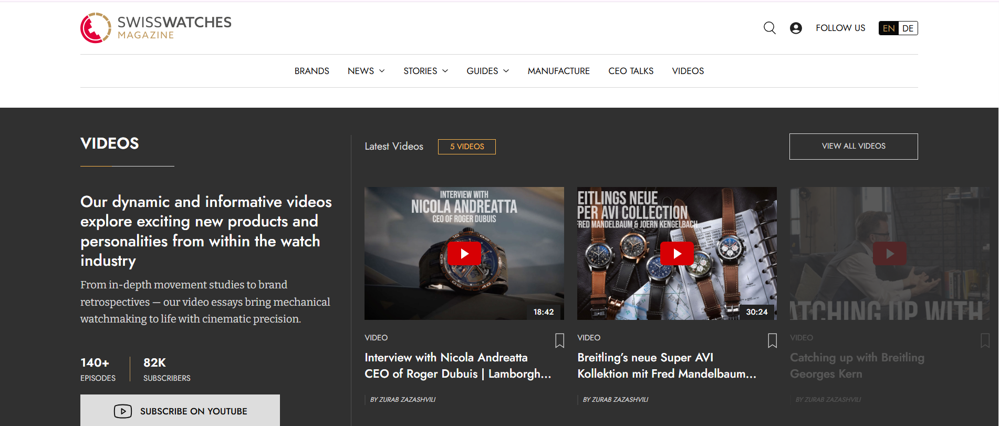

# Swiss Watches Magazine — Frontend Recreation

A pixel-focused recreation of the Swiss Watches Magazine interface based on a provided Figma design.

The project focuses on accurate layout implementation, typography, spacing, reusable UI components, and motion interactions.

## Demo

[](./demo.mp4)


https://github.com/user-attachments/assets/0d9695da-081c-446a-b2be-16f3edb6fcd4


## Tech Stack

- Next.js
- React
- TypeScript
- Tailwind CSS
- Framer Motion

## Implementation

The interface was recreated from a provided Figma design and structured into reusable React components.

The implementation focuses on precise layout reproduction, typography, spacing, component structure, and interactive behavior.

Implemented sections include:

- Header and navigation
- Hero section
- Latest Stories
- Editorial Categories
- Curated content
- News
- Boutique Travel Guide
- Newsletter
- Videos

The project uses a component-based structure for repeated UI patterns and data-driven rendering for reusable content sections.

Next/Image is used for image rendering, while SVG assets exported from the provided design are integrated for logos, icons, and other graphical elements.

## Motion & Interaction

Interactive elements were implemented with Framer Motion.

Framer Motion is used to implement independent interactions for:

- image hover
- category hover
- title hover
- author hover
- bookmark interaction
- buttons and CTA elements

Hover areas are intentionally independent, allowing individual UI elements to react separately rather than triggering animation for the entire card.

Motion behavior includes image scaling, text movement, color transitions, animated accent lines, and button interactions.

Custom easing and transition timing are used to create smooth forward animations with faster return transitions.

## Project Structure

```text
components/
├── animations/
├── layout/
├── sections/
└── ui/

constants/
public/
└── images/
```

## Running Locally

Install dependencies:

npm install

Start the development server:

npm run dev

Create a production build:

npm run build

## Live Demo

https://swiss-watches-magazine.vercel.app/
